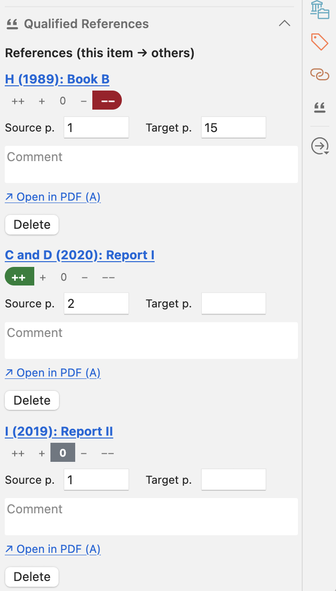
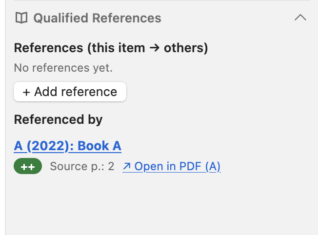
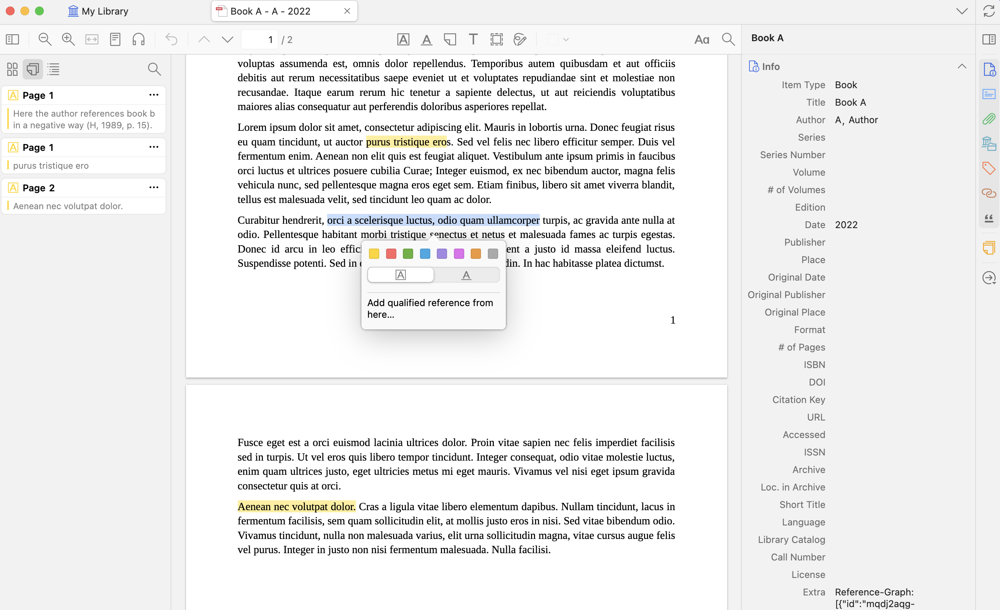
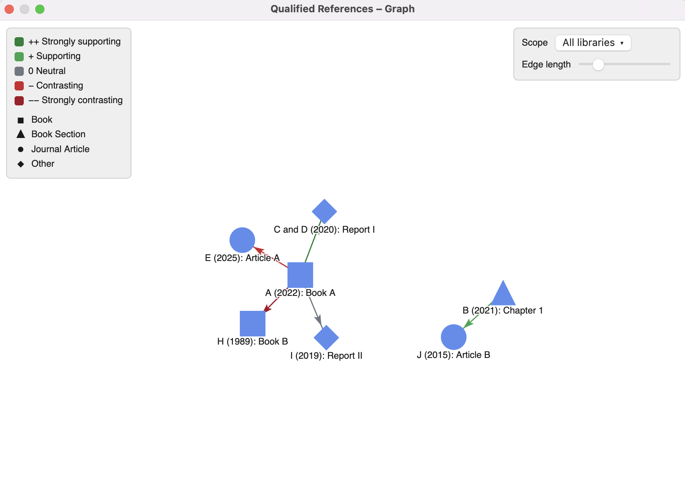
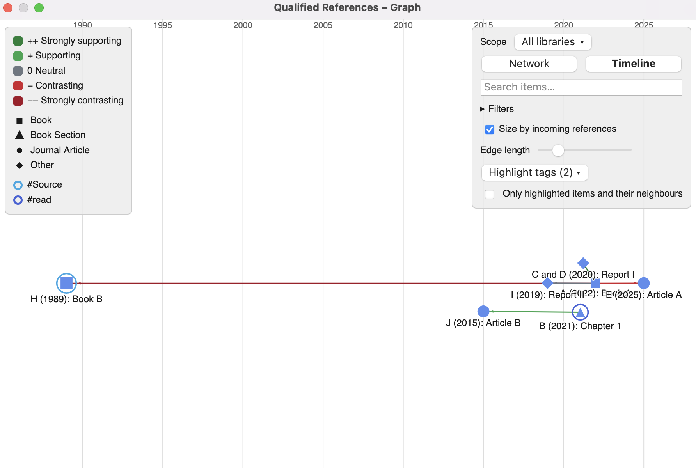
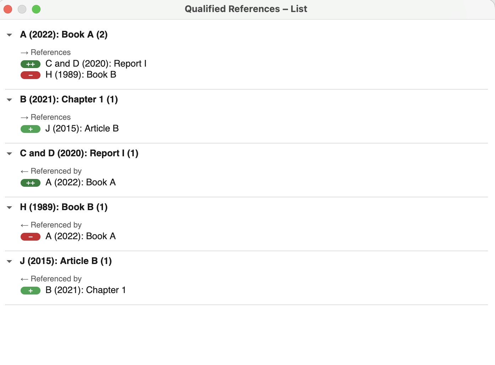
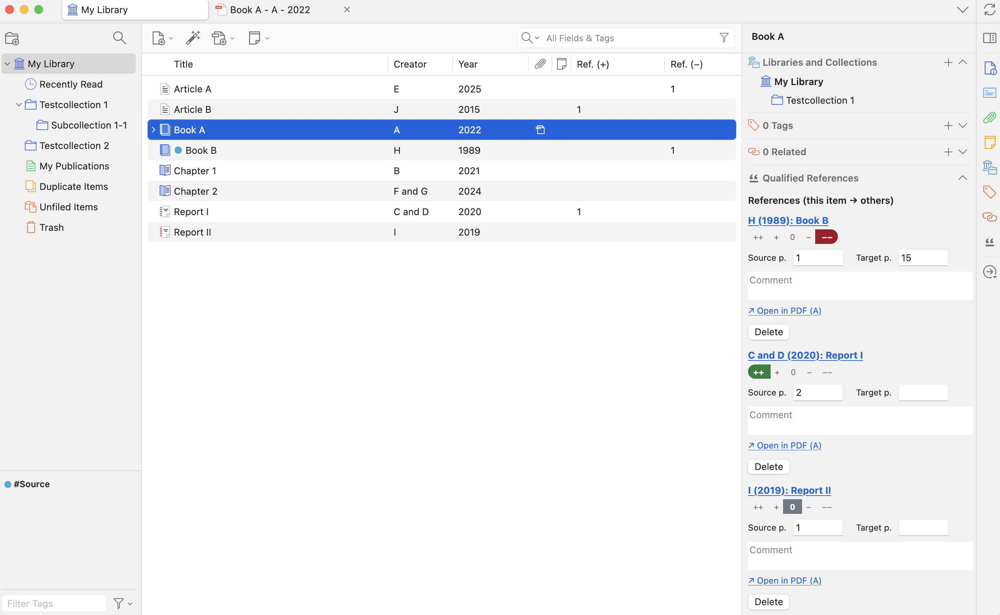
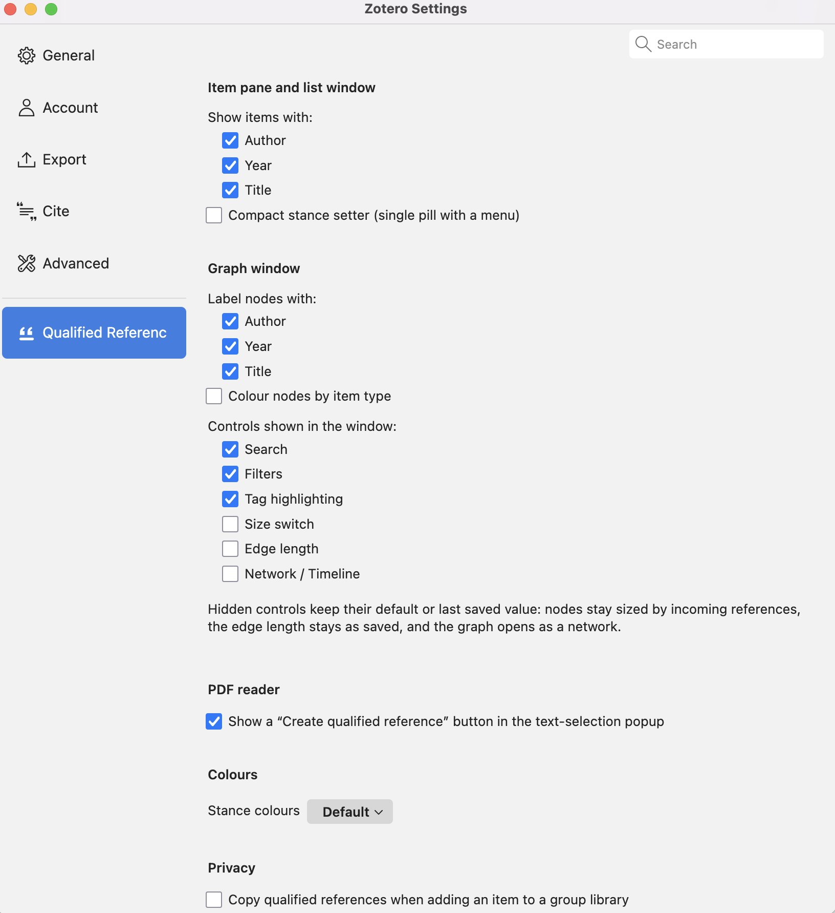

# Qualified References (Zotero plugin)

> ⚠️ **Note:** This plugin was largely "vibe-coded" with **Claude Opus 4.8/5.5**. It
> may contain bugs or rough edges — use at your own discretion, and please
> report issues.

Adds **directed, qualified references** between Zotero items — beyond Zotero's
plain, undirected "Related" links. In an item's right-hand pane you can link to
one or more other items, each with:

- optional **source** and **target page numbers**,
- a 5-point **stance** (`++ + 0 − −−`),
- a free-text **comment**,
- an optional **PDF anchor** — right-click a highlight, or use the button in
  the text-selection popup, in the source item's PDF to create the reference;
  its page number is filled in automatically and you can jump back to the
  passage from either side.



The target item shows a **"Referenced by"** list of incoming links, each with
its stance, pages and a jump-back link. **"Add incoming reference"** below that
list works the other way round: the picked items get a reference to the current
one. The reference is stored on the picked item, but its stance, pages and
comment can be edited in either item; items in read-only libraries are skipped
and their references stay read-only. Settings can turn adding and editing
incoming references off, which makes the list read-only again.



Multiple references from A to B are allowed (e.g. supporting on p. 36,
contrasting on p. 90). On Zotero 10, adding, editing and deleting references can be
undone with **Edit → Undo**.

The **PDF anchor** is created straight from a highlight: right-click a passage
in the source item's PDF and choose _"Add qualified reference from here…"_.
Alternatively, select text without creating a highlight first and use the
button in the selection popup — it creates the highlight and the reference in
one step. This button can be turned off in Settings if you don't want it.



A **Tools → Reference Graph** window visualises the whole network: items as
nodes (shaped and coloured by item type), references as directed arrows
coloured by stance. Node size grows with incoming references; labels appear
for small graphs, when zoomed in, on hover and for the most connected items.
A **search** outlines matching items and dims everything outside their
neighbourhood; a collapsible **Filters** group limits the view by stance, item
type and a minimum number of references. Hovering an arrow shows its stance,
comment and pages; clicking it opens the passage in the PDF or selects the
citing item. Unconnected groups of items are kept apart. Optional layouts
(each switched on separately in the settings, off by default), explained by a
short note in the window:
**timeline** places items by publication year, with undated items in a
separate lane; **ego network** puts one item in the centre, with the items
citing it on a left half circle, the items it cites on a right one and the
next ring faded further out (click an item to recentre); **layers** stacks items by
citation flow, from items citing none of the shown ones at the bottom to the
items building on them above. Legend and controls collapse to a single line
each (remembered), leaving the whole window to the graph. The
graph's **Highlight tags** picker marks items carrying
any of the chosen tags (e.g. `#Quelle` for primary sources) with a ring in the
tag's colour — Zotero's own colour for coloured tags — and can hide everything
except those items and their direct neighbours. A **Tools → Reference List**
window shows the same data as an expandable list, with **Expand all / Collapse
all**, a **search** over title and author, a **stance filter**, a **sort
order** (alphabetical, number of references, year) and the stance balance per
row. Each expanded entry shows its pages, a **↗ PDF** link to the anchored
passage and the comment (one line, the whole text on click). Both windows have a **scope switcher** to narrow the view down to a single
library, a collection (including its sub-collections) or, on Zotero 10, the
**current selection** in Zotero's collection tree. Items in the trash are left
out of both views. Both windows **update live** while open: new, changed or
deleted references and items appear without reopening, and the scope, filters,
search and layout stay as they are. An **Export** menu saves what a window
currently shows: the graph as an image (PNG, optionally with a transparent background), as CSV (one row per reference,
with stance, pages and comment) or as GraphML for Gephi or Cytoscape; the list
as Markdown (one section per item, e.g. for a literature chapter) or as CSV.
Exported items carry a `zotero://select` link back to Zotero.







Two optional, sortable columns for Zotero's item list, **Ref. (+)** and
**Ref. (−)**, count an item's incoming supporting and contrasting references.
Enable them by right-clicking the column header.



## Data storage

Links are stored as a single line in the **source item's `Extra` field**:

```
Reference-Graph: [ { "id": ..., "targetKey": ..., "stance": -1, ... } ]
```

Each entry names its target by item key plus `targetLibRef` — `"u"` for your
personal library or `"g<groupID>"` for a group — because Zotero's numeric
library IDs differ between devices. The numeric `targetLib` is still written for
older plugin versions; entries without `targetLibRef` are located by their item
key and upgraded on the next save.

This syncs natively via Zotero's sync server. The reverse ("referenced by")
view is served by an in-memory index rebuilt at startup and kept fresh through
Zotero's notifier. All storage goes through `src/modules/storage.ts`, so the
backing store can be swapped later without touching the UI.

## Sync & data safety

How the Extra-field storage behaves with Zotero sync (verified against
Zotero's sync source, `syncLocal.js` / `extractExtraFields`):

- **Different fields, different devices → safe.** Zotero merges synced items
  with a three-way diff _per field_. Edits to other fields of the same item
  never touch the `Reference-Graph:` line.
- **Same item's references edited on two devices before syncing → conflict.**
  The whole `Extra` field is one unit: Zotero shows its conflict dialog and the
  side you discard loses its reference changes (there is no line-level merge).
  _Recommendation:_ edit a given item's references on one device at a time; in
  the conflict dialog, the `Reference-Graph:` line is visible — when in doubt,
  keep the side with the longer line, then re-add the missing reference.
- **No auto-conversion.** Zotero only converts known field names / CSL
  variables out of Extra (`Type:` etc.); `Reference-Graph` matches none of
  them and is left untouched.
- **Coexistence.** The plugin parses Extra line-by-line and preserves all
  other lines (covered by tests). Third-party tools that _replace_ the whole
  Extra field would, however, also wipe this line.
- **Export side-effect.** BibTeX/BibLaTeX export maps Extra to the `note`
  field, so the JSON line appears there; CSL citations ignore unknown keys.
- **Notifier resilience.** Each incoming sync notification is processed
  individually inside a try/catch so that one unloadable item (e.g. during a
  large batch sync) cannot abort the reverse-index update for the rest of the
  batch.
- **Copying into a group library.** When you copy an item that carries
  references into a group library (from your personal library or another
  group), the references — including your private
  comments and stance ratings — are **not** copied by default, mirroring how
  Zotero itself drops "Related" links across libraries. This is controlled by
  **Settings → Privacy** (see below) and can be turned on if you do want to
  share them with the group.
- **Backup and restore.** **Settings → Qualified References → Backup**
  saves every reference of every library to one JSON file, with all fields (stance,
  pages, comment, PDF anchor, timestamps) and the items identified by library
  and key. **Restore…** in the same section merges such a file back:
  references an item no longer has are added again, a reference edited later
  than in the backup is kept, and nothing is deleted. Items that are missing,
  in read-only group libraries or would exceed the sync size limit are skipped
  and counted. Use it before risky bulk edits, or to recover the side lost in a
  sync conflict or a line wiped by another tool.
- **Change journal.** Before each change to an item's references, the plugin
  keeps the previous state in `qualified-references-journal.json` in the
  Zotero profile folder: the last 10 states per item, on this device only, not
  synced. The item pane lists them under **Earlier states**, each with a
  **Restore** button (undoable in Zotero 10). This covers the side discarded in
  a sync conflict and changes made by other tools. The file contains your
  comments in plain text, like Zotero's own database.
- **Removals by other tools.** When the `Reference-Graph:` line of an item with
  references disappears or becomes unreadable without the plugin, a notice
  says so and the item pane offers to restore the last state. To tell such
  removals apart, the plugin keeps an empty `Reference-Graph: []` line after
  you delete an item's last reference. Devices still running a version before
  0.11.0 remove the line instead, which other devices then report as a
  removal. Partial changes by other tools are not reported; the journal still
  has the earlier state.

## Scale & limits

The plugin is built around an in-memory reverse index, sized to the number of
**references** rather than the size of your library:

- **The index only holds items that actually have references.** A library with
  tens of thousands of items but a few hundred references uses a correspondingly
  small index (memory grows with reference count, not library size).
- **Startup is non-blocking.** The reverse index is built in the background
  after Zotero's UI is ready; the item-pane section and views work as soon as
  the index finishes (typically well under a second; a few seconds for very
  large libraries). Incremental edits stay O(1) via a secondary
  `source → targets` index, so bulk add/delete does not degrade.
- **Per-field cap.** Each item's reference data lives on one line of its `Extra`
  field. Individual text fields within a reference (the comment, page strings
  and keys) are capped at 10 000 characters on read as a sanity limit.
- **Sync size limit.** Zotero's sync server rejects fields larger than
  64 KB, so the plugin refuses a save that would grow `Extra` beyond about
  60 000 bytes and says so; comments typed in the item pane are limited to 2 000
  characters (adjustable in the settings, 100–10 000). In practice that is roughly 200–350 references per source item
  without long comments.
- **Practical ceiling.** Tens of thousands of references are fine. The graph and
  list windows render every reference at once, so a graph with thousands of
  edges becomes visually dense — use the graph's filters and search, or the
  **edge-length slider** (switched on in the settings) to spread it out.

## Settings

Open **Zotero → Settings → Qualified References**. The page is grouped by where
a setting takes effect:

- **Item pane and list window:** which fields (author / year / title) label
  items, the compact single-pill stance setter instead of the default
  segmented scale, and the maximum comment length (2 000 characters).
- **Graph window:** which fields label nodes, colouring nodes by item type, and
  which controls the window shows (search, filters and tag highlighting on by
  default; node-size switch and edge-length slider off by default), which extra
  layouts the window offers (timeline, ego network, layers; all off by
  default), and a transparent background for the PNG export.
- **PDF reader:** the "create qualified reference" button in the text-selection
  popup (on by default).
- **Colours:** the stance palette (default or colour-blind safe).
- **Privacy:** copying references into group libraries (off by default).
- **Backup:** back up all references to a JSON file and restore them (see
  [Sync & data safety](#sync--data-safety)).



## Installation

Requires **Zotero 9 or 10**.

1. Download the latest `.xpi` from the [Releases](https://github.com/JanR383/zotero-qualified-references/releases) page.
2. In Zotero: **Tools → Plugins → ⚙ (gear) → Install Plugin From File…** and select the `.xpi`.
3. Restart Zotero.

Once installed, Zotero checks the release's `update.json` for new versions and
updates the plugin automatically.

## Development

Requires Node.js 22.18 or newer (`.nvmrc` pins 24).

```bash
npm install
cp .env.example .env   # point to a DEDICATED dev Zotero profile
npm start              # side-load + hot-reload in Zotero
npm run build          # produce .scaffold/build/*.xpi
```

Built on the [zotero-plugin-template](https://github.com/windingwind/zotero-plugin-template)
stack (TypeScript, `zotero-plugin-scaffold`, `zotero-types`).

## Acknowledgements / Third-party

This project reuses the following libraries, code patterns and design sources:

- **[force-graph](https://github.com/vasturiano/force-graph)** by Vasco Asturiano
  (MIT) — renders the reference-graph window. Bundled locally; its and its
  dependencies' licence notices are preserved in
  `content/scripts/graph.js.LEGAL.txt`.
- **[zotero-plugin-template](https://github.com/windingwind/zotero-plugin-template)**
  (AGPL-3.0-or-later) by windingwind — project scaffold and build pipeline.
- **Window pattern** — opening the graph via `openDialog` + `window.arguments`
  follows Zotero's own `selectItemsDialog.xhtml` (mirrored in
  `src/modules/picker.ts`).
- **PDF anchors** — the reader integration uses
  `Zotero.Reader.registerEventListener("createAnnotationContextMenu", …)` and
  `"renderTextSelectionPopup"`; jumping to an annotation uses
  `Zotero.Reader.open(id, { annotationID })`, the same `location` Zotero's
  `zotero://open-pdf` handler builds.
- **Zotero source patterns** (reverse-engineered from `omni.ja`) — the section
  header FTL attribute syntax (`.label` / `.tooltiptext`), the
  `collapsible-section` title binding, and `MozXULElement.insertFTLIfNeeded`
  for synchronous l10n resource loading.
- **Stance colours** — the default green→red palette in `addon/content/qref.css`
  is based on the [GitHub Primer](https://primer.style/) success/danger/neutral
  scales (contrast-checked for light and dark mode). The optional colour-blind
  safe palette (Preferences → Stance colours) uses the
  [Okabe–Ito palette](https://jfly.uni-koeln.de/color/) (blue ↔ orange/vermillion).
- **Item-type colours** — the graph's node colours per item type
  (`src/modules/itemTypeColors.ts`) are taken from the
  [Open Color](https://yeun.github.io/open-color/) palette (MIT).

This plugin is licensed under **AGPL-3.0-or-later** (see `LICENSE`). The
complete corresponding source is available in this repository.
